# FFmpeg Engine - Project Directory Structure

```mermaid
graph TD
    subgraph "Project Root"
        A[".gitignore"]
        B["README.md"]
        C["SPEC.md"]
        D["build.gradle.kts"]
        E["settings.gradle.kts"]
        F["gradle.properties"]
        G[".github/"]
    end
    
    subgraph ".github"
        H["workflows/"]
        I["android.yml"]
    end
    
    subgraph "app/"
        J["build.gradle.kts"]
        K["proguard-rules.pro"]
        L["AndroidManifest.xml"]
    end
    
    subgraph "app/src/main/"
        M["res/"]
        N["java/com/ffmpeg/engine/"]
    end
    
    subgraph "res/"
        O["values/"]
        P["drawable/"]
        Q["mipmap-*/"]
        R["xml/"]
    end
    
    subgraph "java/com/ffmpeg/engine/"
        S["FFmpegEngineApp.kt"]
        T["di/"]
        U["domain/"]
        V["data/"]
        W["presentation/"]
    end
    
    subgraph "di/"
        X["AppModule.kt"]
    end
    
    subgraph "domain/"
        Y["model/"]
        Z["repository/"]
        AA["usecase/"]
    end
    
    subgraph "model/"
        AB["MediaInfo.kt"]
        AC["EncodingConfig.kt"]
        AD["EncodingState.kt"]
    end
    
    subgraph "repository/"
        AE["Repositories.kt"]
    end
    
    subgraph "data/"
        AF["local/"]
        AG["repository/"]
    end
    
    subgraph "local/"
        AH["FFmpegService.kt"]
        AI["PreferencesManager.kt"]
    end
    
    subgraph "repository/"
        AJ["MediaRepositoryImpl.kt"]
        AK["EncodingRepositoryImpl.kt"]
        AL["PresetRepositoryImpl.kt"]
    end
    
    subgraph "presentation/"
        AM["MainActivity.kt"]
        AN["navigation/"]
        AO["ui/"]
        AP["viewmodel/"]
    end
    
    subgraph "navigation/"
        AQ["Screen.kt"]
    end
    
    subgraph "ui/"
        AR["screens/"]
        AS["theme/"]
        AT["components/"]
    end
    
    subgraph "screens/"
        AU["EncodeScreen.kt"]
        AV["PresetsScreen.kt"]
        AW["HistoryScreen.kt"]
        AX["SettingsScreen.kt"]
    end
    
    subgraph "theme/"
        AY["Theme.kt"]
        AZ["Color.kt"]
        BA["Typography.kt"]
    end
    
    subgraph "viewmodel/"
        BB["EncodeViewModel.kt"]
    end
```



## Directory Tree View

```
FFmpegEngine/
├── .github/
│   └── workflows/
│       └── android.yml
├── .gitignore
├── README.md
├── SPEC.md
├── build.gradle.kts
├── settings.gradle.kts
├── gradle.properties
├── gradlew
├── gradlew.bat
├── gradle/
│   └── wrapper/
│       ├── gradle-wrapper.properties
│       └── gradle-wrapper.jar
└── app/
    ├── build.gradle.kts
    ├── proguard-rules.pro
    └── src/main/
        ├── AndroidManifest.xml
        ├── java/com/ffmpeg/engine/
        │   ├── FFmpegEngineApp.kt
        │   ├── di/
        │   │   └── AppModule.kt
        │   ├── domain/
        │   │   ├── model/
        │   │   │   ├── MediaInfo.kt
        │   │   │   ├── EncodingConfig.kt
        │   │   │   └── EncodingState.kt
        │   │   └── repository/
        │   │       └── Repositories.kt
        │   ├── data/
        │   │   ├── local/
        │   │   │   ├── FFmpegService.kt
        │   │   │   └── PreferencesManager.kt
        │   │   └── repository/
        │   │       ├── MediaRepositoryImpl.kt
        │   │       ├── EncodingRepositoryImpl.kt
        │   │       └── PresetRepositoryImpl.kt
        │   └── presentation/
        │       ├── MainActivity.kt
        │       ├── navigation/
        │       │   └── Screen.kt
        │       ├── ui/
        │       │   ├── screens/
        │       │   │   ├── EncodeScreen.kt
        │       │   │   ├── PresetsScreen.kt
        │       │   │   ├── HistoryScreen.kt
        │       │   │   └── SettingsScreen.kt
        │       │   └── theme/
        │       │       ├── Theme.kt
        │       │       ├── Color.kt
        │       │       └── Typography.kt
        │       └── viewmodel/
        │           └── EncodeViewModel.kt
        └── res/
            ├── values/
            │   ├── strings.xml
            │   ├── colors.xml
            │   └── themes.xml
            ├── drawable/
            │   ├── ic_launcher_background.xml
            │   └── ic_launcher_foreground.xml
            ├── mipmap-anydpi-v26/
            │   ├── ic_launcher.xml
            │   └── ic_launcher_round.xml
            └── xml/
                ├── file_paths.xml
                ├── backup_rules.xml
                └── data_extraction_rules.xml
```
