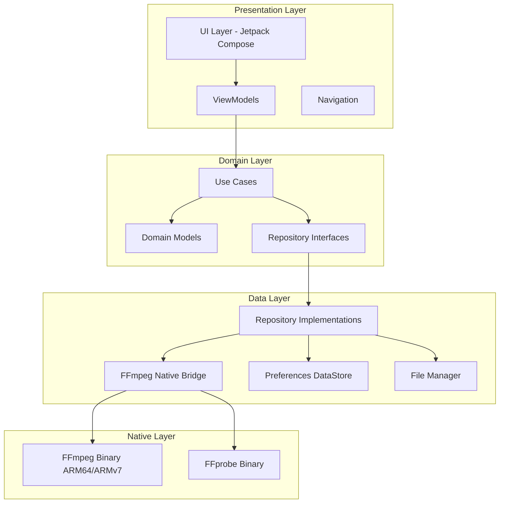
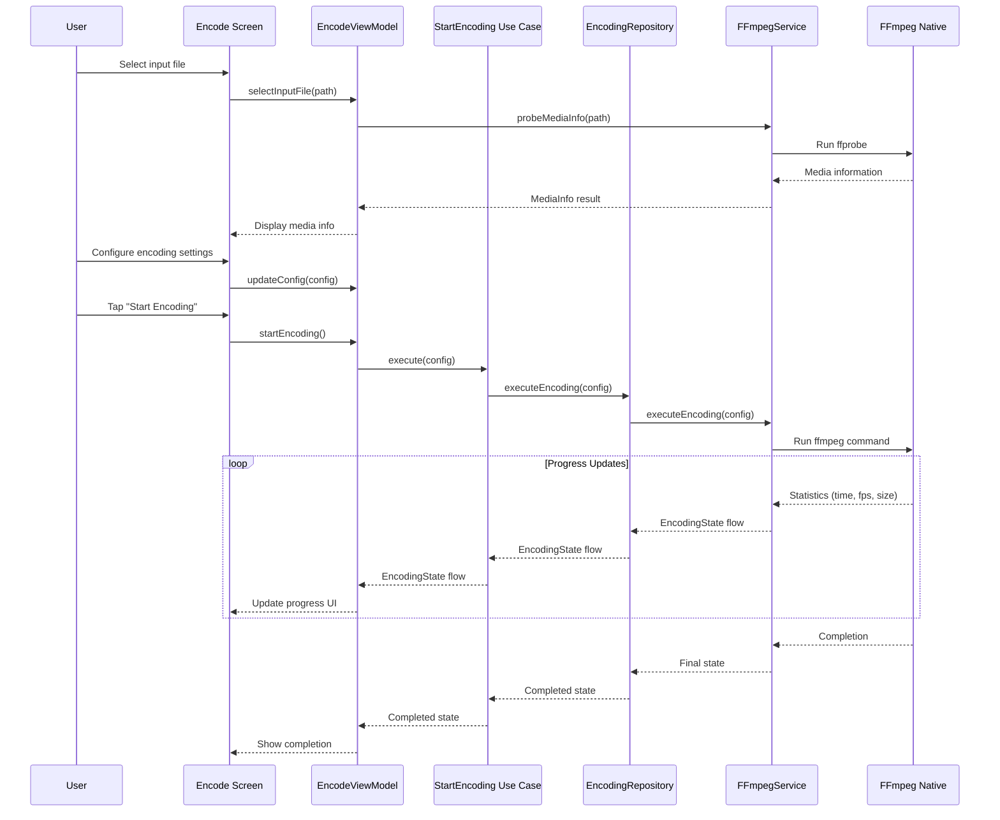
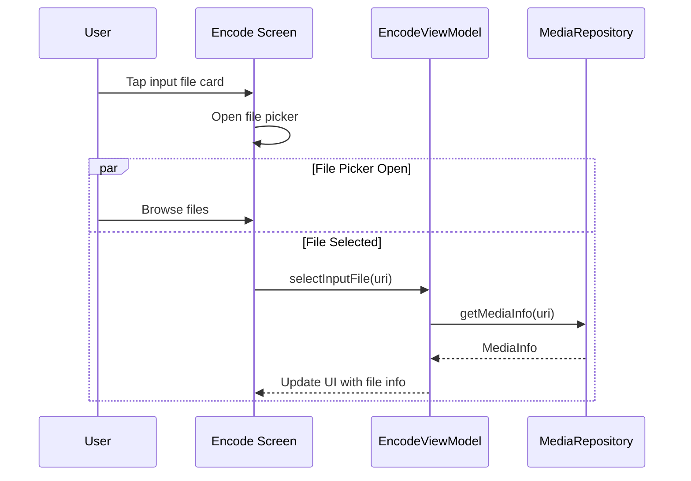
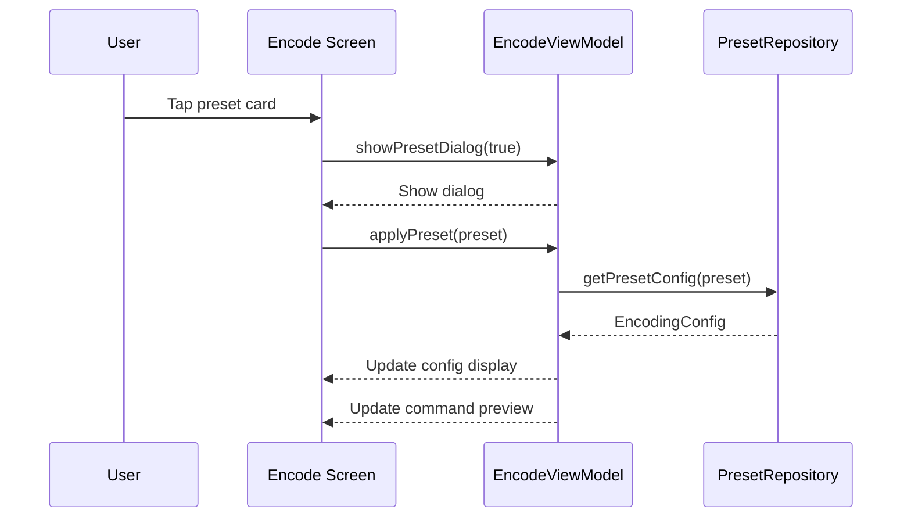
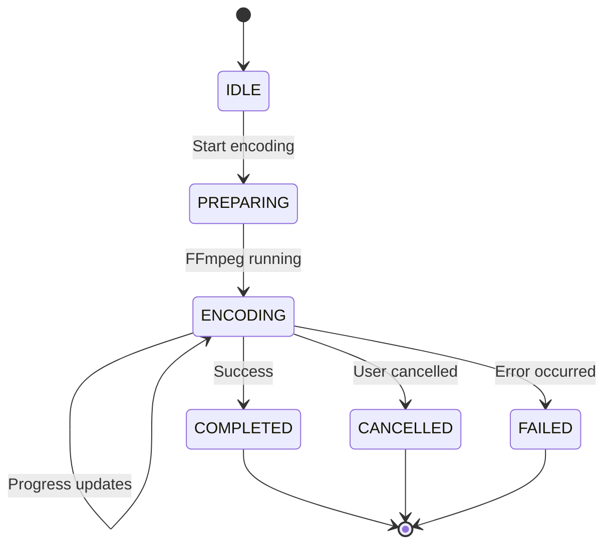
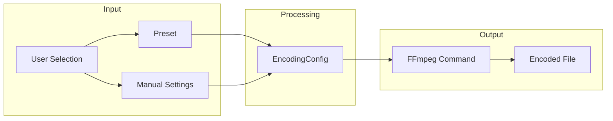
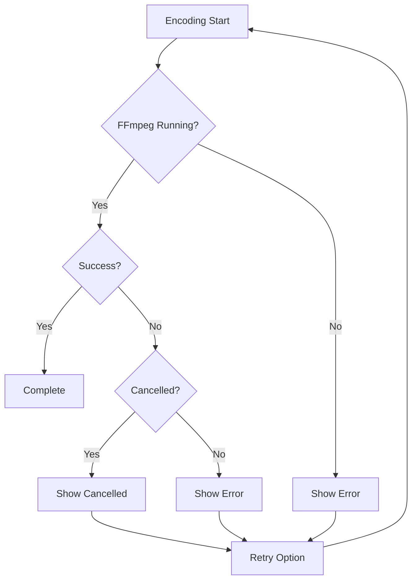

# FFmpeg Engine - Technical Architecture Documentation

## Table of Contents
1. [System Overview](#system-overview)
2. [Module Diagram](#module-diagram)
3. [Sequence Diagrams](#sequence-diagrams)
4. [Data Flow](#data-flow)
5. [Component Architecture](#component-architecture)

---

## System Overview

The FFmpeg Engine is a native Android application that provides comprehensive media encoding capabilities using FFmpeg compiled from source for ARM-based mobile devices.

### Core Features
- Video transcoding (H.264, H.265/HEVC, VP8, VP9, AV1)
- Audio transcoding (AAC, MP3, Opus, Vorbis, FLAC)
- Format conversion (MP4, MKV, WebM, AVI, MOV)
- Stream copying (re-muxing without re-encoding)
- Video filters (scale, crop, rotate, flip)
- Preset management
- Real-time progress tracking

---

## Module Diagram



---

## Sequence Diagrams

### 1. Media Encoding Flow



### 2. File Selection Flow



### 3. Preset Selection Flow



---

## Data Flow

### Encoding State Flow



### Configuration Data Flow



---

## Component Architecture

### 1. Presentation Layer

#### MainActivity
- Entry point for the application
- Sets up Compose UI
- Handles navigation

#### EncodeScreen
- File selection UI
- Encoding configuration UI
- Progress display
- Preset selection dialog

#### EncodeViewModel
- Manages UI state
- Handles user interactions
- Coordinates with use cases

### 2. Domain Layer

#### Use Cases
- `GetMediaInfoUseCase`: Retrieves media file information
- `StartEncodingUseCase`: Initiates encoding process
- `CancelEncodingUseCase`: Cancels ongoing encoding
- `GetPresetsUseCase`: Retrieves available presets

#### Domain Models
- `MediaInfo`: Media file metadata
- `EncodingConfig`: Encoding parameters
- `EncodingState`: Current encoding status
- `Preset`: Pre-defined encoding configurations

### 3. Data Layer

#### FFmpegService
- Interface for FFmpeg operations
- Command generation
- Progress callback handling

#### MediaRepository
- File system access
- Media information parsing

#### EncodingRepository
- Encoding execution
- Progress management
- State management

### 4. Native Layer

#### FFmpeg Binary (ARM64/ARMv7)
- Compiled from FFmpeg source
- Supports all major codecs
- Lightweight build for mobile

#### FFprobe Binary
- Media information extraction
- Stream analysis

---

## File Structure

```
app/src/main/
├── java/com/ffmpeg/engine/
│   ├── FFmpegEngineApp.kt          # Application class
│   ├── di/                         # Dependency injection
│   │   └── AppModule.kt
│   ├── domain/                     # Domain layer
│   │   ├── model/                  # Domain models
│   │   ├── repository/             # Repository interfaces
│   │   └── usecase/               # Use cases
│   ├── data/                       # Data layer
│   │   ├── local/                 # Local services
│   │   └── repository/            # Repository implementations
│   └── presentation/               # Presentation layer
│       ├── MainActivity.kt
│       ├── navigation/            # Navigation
│       ├── ui/                    # UI components
│       │   ├── screens/           # Screen composables
│       │   └── theme/             # Theme
│       └── viewmodel/             # ViewModels
├── jniLibs/                       # Native libraries
│   ├── arm64-v8a/
│   │   └── libffmpeg.so
│   └── armeabi-v7a/
│       └── libffmpeg.so
└── res/                           # Resources
```

---

## Build Configuration

### Native Library Integration

The app uses native FFmpeg binaries that are:
1. Compiled from source for Android ARM
2. Placed in `jniLibs` directory
3. Loaded at runtime via System.loadLibrary()

### ABI Support
- `arm64-v8a`: Modern devices (2016+)
- `armeabi-v7a`: Older devices

---

## Error Handling



---

## Testing Strategy

### Unit Tests
- ViewModel logic
- Use case business logic
- Model serialization
- Command building

### Integration Tests
- Repository implementations
- FFmpeg command execution (mocked)
- File system operations

### UI Tests
- Screen interactions
- Navigation flows
- State updates
